# 🔐 JDBC-Based Spring Security Auth + Authorization Flow (Detailed)

```mermaid
sequenceDiagram
    actor 👤 Client
    participant 🔐 SecurityFilterChain
    
    participant 🔍 UsernamePasswordAuthenticationFilter
    participant 🧠 AuthenticationManager
    participant 🧾 CustomUserDetailsService
    participant 🗄️ UserRepository
    participant 📂 RoleRepository
    participant 🧰 BCryptPasswordEncoder
    participant 🧠 SecurityContextHolder
    participant 📦 Controller

    Note over 👤 Client: Sends HTTP GET<br>Authorization: Basic bharath:bharath123

    👤 Client->>🔐 SecurityFilterChain: Request → `/api/v1/posts/123`
    🔐 SecurityFilterChain->>🔍 UsernamePasswordAuthenticationFilter: Extract username/password
    🔍 UsernamePasswordAuthenticationFilter->>🧠 AuthenticationManager: Authenticate()
    
    🧠 AuthenticationManager->>🧾 CustomUserDetailsService: loadUserByUsername("bharath")
    🧾 CustomUserDetailsService->>🗄️ UserRepository: findByUsername("bharath")
    🗄️ UserRepository-->>🧾 CustomUserDetailsService: Returns `User` entity

    🧾 CustomUserDetailsService->>📂 RoleRepository: fetch user roles
    📂 RoleRepository-->>🧾 CustomUserDetailsService: Returns [ "ROLE_USER" ]

    🧾 CustomUserDetailsService->>🧠 AuthenticationManager: Return UserDetails object

    🧠 AuthenticationManager->>🧰 BCryptPasswordEncoder: matches(raw, encoded)
    🧰 BCryptPasswordEncoder-->>🧠 AuthenticationManager: ✅ match success

    🧠 AuthenticationManager-->>🔍 UsernamePasswordAuthenticationFilter: Authenticated Token
    🔍 UsernamePasswordAuthenticationFilter->>🧠 SecurityContextHolder: Store Auth Token

    🔐 SecurityFilterChain->>🔐 AuthorizationFilter: Check role permissions
    🔐 AuthorizationFilter-->>🔐 SecurityFilterChain: Access granted ✅

    🔐 SecurityFilterChain->>📦 Controller: Forward to handler
    📦 Controller-->>👤 Client: HTTP 200 OK + JSON response

```



# ✨ Chatflow PaaS: Empowering Agentic Applications at Scale

## Overview

Chatflow PaaS (Platform-as-a-Service) is a modular, agent-oriented platform designed to empower enterprises to seamlessly integrate, configure, and deploy conversational and agentic workflows. It abstracts the complexity of managing LLMs, routing, and external APIs, and enables composable AI-driven applications.

---

## 🧱 High-Level Architecture Diagram


---

## 🧩 Key Components and Interaction Flow

| Component | Description |
|----------|-------------|
| **Frontend App** | UI to collect input (e.g., question, prompt) and display chat responses. |
| **Chatflow Gateway** | Stateless HTTP API service that receives frontend input and routes it to orchestration layer. |
| **Chat Orchestration Engine** | Central brain that handles routing logic, agent switching, fallback strategies, and interaction context. |
| **Agent Router** | Determines which agent or skill to invoke based on input, metadata, or routing logic. |
| **Agent Registry** | Stores all available agents and their configurations (skills, functions, models). |
| **LLM Worker** | Wraps calls to LLMs like GPT-4, Claude, or Gemini with retry, logging, and observability. |
| **Function Worker** | Executes special API calls or utility functions defined in the agent's YAML/JSON config. |
| **External APIs / KBs** | Third-party tools, internal services, or RAG-based search systems. |
| **Auth & Tenant Mgmt** | Supports multi-tenant access, token verification, and scoped permissions. |
| **Chat History / Vector DB** | Stores previous conversation chunks for RAG and context-based LLM prompting. |

---

## Sequence Diagram: User Interaction Flow

```mermaid
sequenceDiagram
    participant User as 🧑‍💻 User
    participant Frontend as 🖥️ Frontend App (Web/Mobile)
    participant Gateway as 🌐 Chatflow Gateway/API
    participant Orchestrator as 🧠 Chat Orchestration Engine
    participant Router as 🔀 Agent Router
    participant Registry as 📚 Agent Registry
    participant LLM as 🧠 LLM Worker (GPT, Claude)
    participant Function as 🔧 Function Worker / API Plugin
    participant API as 🌍 External APIs / KBs
    participant Auth as 🔐 Auth & Tenant Mgmt
    participant Store as 🧾 Agent Config Store (YAML/JSON)
    participant VectorDB as 🧠 Chat History / Vector DB
    participant Telemetry as 📊 Telemetry & Analytics

    User->>Frontend: Enters question / prompt
    Frontend->>Gateway: POST /api/chatflow/ask with question, agent, tenantId
    Gateway->>Auth: Validate auth token & tenant
    Auth-->>Gateway: ✅ Validated

    Gateway->>Telemetry: Log request metadata
    Gateway->>Orchestrator: Forward request to orchestration engine

    Orchestrator->>Router: Route to correct agent
    Router->>Registry: Lookup agent by name (e.g., "travelPlanner")
    Registry-->>Router: Return agent details (skills, config)

    Router->>Store: Fetch YAML/JSON agent config
    Store-->>Router: Return agent configuration

    Router->>Function: Call tool - weather API (e.g., Bali forecast)
    Function->>API: GET /weather?location=Bali
    API-->>Function: Return weather info
    Function-->>Router: Return tool response

    Router->>Function: Call tool - budgetEstimator(location, budget)
    Function-->>Router: Return cost estimate

    Router->>VectorDB: Retrieve recent conversation history
    VectorDB-->>Router: Return context

    Router->>LLM: Prompt LLM with input + context + tools
    LLM-->>Router: Return response

    Router->>Orchestrator: Return final result
    Orchestrator->>Gateway: Format & log result
    Gateway->>Frontend: Stream or return chat response
    Frontend->>User: Show response in chat UI

    Gateway->>Telemetry: Log success & latency metrics


```

----


## 🧠 Chatflow PaaS - Orchestrator & Router Deep Dive

---

### 🧠 How Orchestrator Makes Decisions and Coordinates Flow

#### 🎯 Role of Orchestrator

The **Chat Orchestration Engine** is like a smart traffic controller. Its job is to:
- Understand what the user wants.
- Decide which agent or skill to call.
- Maintain chat context (memory).
- Handle multi-step workflows.
- Track success/failure of each step.

---

#### 🛠️ Step-by-Step Breakdown with Example

**User Input:**
> “Can you plan a 3-day trip to Paris under $800?”

##### 🔁 Step 1: Receive Input
- Input received from Gateway.
- Payload: `question="Can you plan a 3-day trip to Paris under $800?"`

##### 🔁 Step 2: Identify Agent to Use
- Agent specified as: `travelPlanner`

##### 🔁 Step 3: Load Workflow
```yaml
agent: travelPlanner
tools:
  - name: weatherTool
    type: api
    endpoint: /weather
  - name: budgetEstimator
    type: function
    params: [location, days, budget]
llm_prompt: >
  You are a smart travel agent. Use context and tools to plan trips.
```

##### 🔁 Step 4: Plan the Execution
1. Get weather info
2. Estimate budget
3. Send everything to LLM

##### 🔁 Step 5: Run Steps
- Call: `weatherAPIWorker("Paris", "3 days")`
- Call: `budgetEstimator("Paris", 3, 800)`
- Prompt LLM with context and tools

##### 🔁 Step 6: Return & Log
- Send response to frontend
- Log telemetry and results

---

### 🧭 How Router Picks the Right Agent

#### 🎯 Role of Agent Router

The **Agent Router** is like a matchmaker. It finds the best agent to handle a user request.

---

#### 📚 Example 1: Explicit Agent Provided
```json
{ "agent": "travelPlanner" }
```
- Looks up `travelPlanner.yaml` in Agent Registry

---

#### 🧠 Example 2: Implicit Agent Routing
**User Input:** “Summarize the latest quarterly sales report.”

##### Router Decision Strategy:
- Keyword match: “summarize” → `reportSummarizer`
- Vector search for intent
- Use tenant default if unsure

---

#### 🛠️ Example 3: Conditional Routing
**User Input:** “Help me with deployment issues in Kubernetes”

##### Router matches:
- Intent: devops-help
- Agent chosen: `devOpsHelper.yaml`

---

## ✅ Real-Time Simulation

```plaintext
User: “What’s the cheapest way to travel to Tokyo in winter?”

Frontend → Gateway → Orchestrator
Orchestrator → Router: find best agent
Router → AgentRegistry → `travelPlanner.yaml`
Orchestrator runs:
  - weatherAPI("Tokyo", "Dec-Feb")
  - budgetEstimator("Tokyo", "budget": low)
  - LLM(Prompt + context)
→ Final output is streamed to frontend
```

---

## 🎯 Use Cases

1. **Travel Planner Bot** – Uses LLM + FunctionWorker to call weather APIs, suggest destinations.
2. **Customer Support Agent** – Uses LLM + Company KB + fallback escalation.
3. **Developer Assistant** – Integrates with GitHub/GitLab to automate code suggestions and PR generation.
4. **Financial Summary Agent** – Pulls data from internal finance APIs, summarizes quarterly performance.

---

## 🔁 Real-Time Simulation: Frontend + Chatflow PaaS

Let’s simulate how a **frontend React web app** interacts with the Chatflow PaaS to implement a travel assistant.

### Step 1: User Input
```json
POST /api/chatflow/ask
{
  "question": "Plan a 5-day trip to Bali with budget constraints",
  "tenantId": "travelCorp",
  "agent": "travelPlanner"
}
```

### Step 2: Gateway forwards to Orchestration Engine

- Auth token checked
- Routes request to `travelPlanner` agent
- Agent YAML defines:
  - Tool 1: Weather API
  - Tool 2: Budget estimation function
  - Tool 3: GPT-4 LLM with system prompt

### Step 3: Agent Workflow

1. Runs `weatherAPIWorker("Bali", "next 5 days")`
2. Executes `budgetEstimator(location, budgetRange)`
3. Prompts LLM:

```plaintext
System Prompt: "You are an expert travel agent..."
User Prompt: "Plan a 5-day trip to Bali..."
Context: [weather, cost, preferences]
```

### Step 4: Response

- LLM responds with a travel plan.
- Output is formatted and streamed back to the frontend.

---

## 📅 Project Timeline (Example)

| Milestone | Status |
|-----------|--------|
| Q1 2025   | Project kick-off & PoC |
| Q2 2025   | Agent YAML DSL defined |
| Q3 2025   | Plug-in-based orchestration engine built |
| Q4 2025   | Multi-tenant support & RAG integration |
| Q1 2026   | Agent store, analytics, vector DB rollout |
| Q1 2026   | Full-scale deployment with real-time orchestration |
