# 🔐 JDBC-Based Spring Security Auth + Authorization Flow (Detailed)

```mermaid
sequenceDiagram
    actor 👤 Client
    participant 🔐 SecurityFilterChain
    
    participant 🔍 UsernamePasswordAuthenticationFilter
    participant 🧠 AuthenticationManager
    participant 🧾 CustomUserDetailsService
    participant 🗄️ UserRepository
    participant 📂 RoleRepository
    participant 🧰 BCryptPasswordEncoder
    participant 🧠 SecurityContextHolder
    participant 📦 Controller

    Note over 👤 Client: Sends HTTP GET<br>Authorization: Basic bharath:bharath123

    👤 Client->>🔐 SecurityFilterChain: Request → `/api/v1/posts/123`
    🔐 SecurityFilterChain->>🔍 UsernamePasswordAuthenticationFilter: Extract username/password
    🔍 UsernamePasswordAuthenticationFilter->>🧠 AuthenticationManager: Authenticate()
    
    🧠 AuthenticationManager->>🧾 CustomUserDetailsService: loadUserByUsername("bharath")
    🧾 CustomUserDetailsService->>🗄️ UserRepository: findByUsername("bharath")
    🗄️ UserRepository-->>🧾 CustomUserDetailsService: Returns `User` entity

    🧾 CustomUserDetailsService->>📂 RoleRepository: fetch user roles
    📂 RoleRepository-->>🧾 CustomUserDetailsService: Returns [ "ROLE_USER" ]

    🧾 CustomUserDetailsService->>🧠 AuthenticationManager: Return UserDetails object

    🧠 AuthenticationManager->>🧰 BCryptPasswordEncoder: matches(raw, encoded)
    🧰 BCryptPasswordEncoder-->>🧠 AuthenticationManager: ✅ match success

    🧠 AuthenticationManager-->>🔍 UsernamePasswordAuthenticationFilter: Authenticated Token
    🔍 UsernamePasswordAuthenticationFilter->>🧠 SecurityContextHolder: Store Auth Token

    🔐 SecurityFilterChain->>🔐 AuthorizationFilter: Check role permissions
    🔐 AuthorizationFilter-->>🔐 SecurityFilterChain: Access granted ✅

    🔐 SecurityFilterChain->>📦 Controller: Forward to handler
    📦 Controller-->>👤 Client: HTTP 200 OK + JSON response

```



----------

## ER Diagram


----

## Insert Dummy Data (SQL)

```sql
INSERT INTO roles (name) VALUES ('USER'), ('ADMIN');

INSERT INTO users (username, password, enabled) VALUES 
('bharath', '$2a$10$Jv9FjB...', true),  -- bcrypt encoded
('admin', '$2a$10$K8s9gH...', true);

INSERT INTO user_roles (user_id, role_id) VALUES
(1, 1), -- bharath -> USER
(2, 2); -- admin -> ADMIN

```
