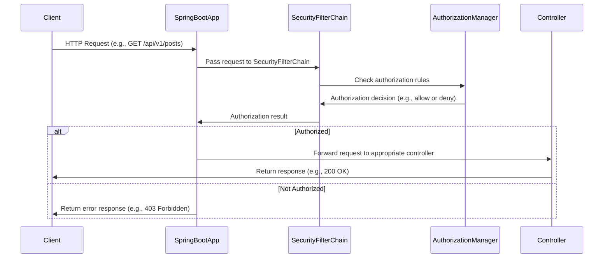
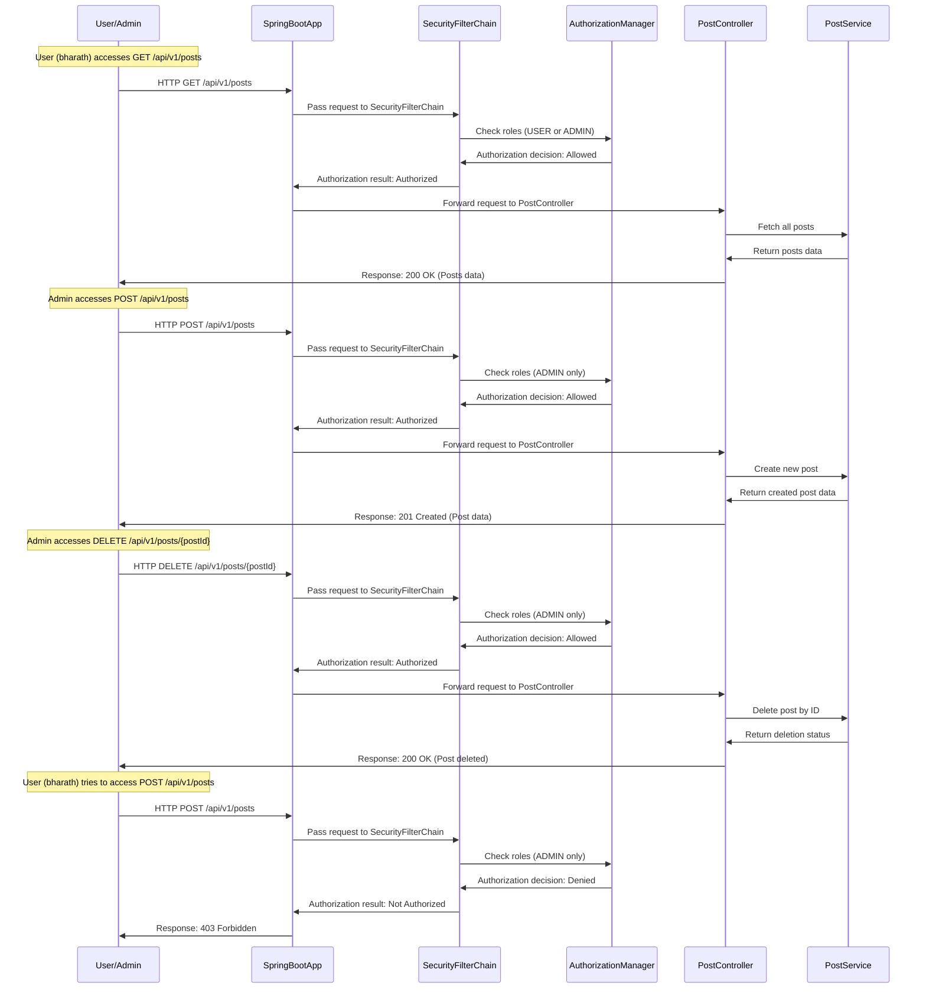
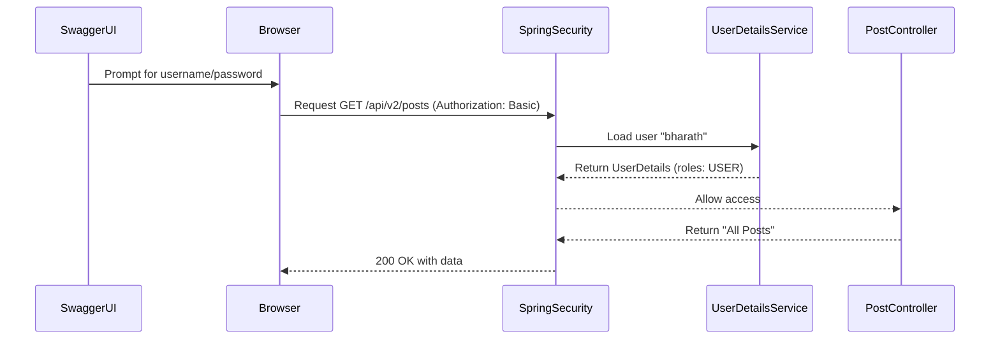
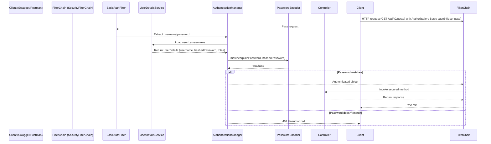

```mermaid
sequenceDiagram
    participant Client
    participant SpringBootApp
    participant SecurityFilterChain
    participant AuthorizationManager
    participant Controller

    Client->>SpringBootApp: HTTP Request (e.g., GET /api/v1/posts)
    SpringBootApp->>SecurityFilterChain: Pass request to SecurityFilterChain
    SecurityFilterChain->>AuthorizationManager: Check authorization rules
    AuthorizationManager->>SecurityFilterChain: Authorization decision (e.g., allow or deny)
    SecurityFilterChain->>SpringBootApp: Authorization result
    alt Authorized
        SpringBootApp->>Controller: Forward request to appropriate controller
        Controller->>Client: Return response (e.g., 200 OK)
    else Not Authorized
        SpringBootApp->>Client: Return error response (e.g., 403 Forbidden)
    end
```
----

```mermaid
sequenceDiagram
    participant Client as User/Admin
    participant SpringBootApp
    participant SecurityFilterChain
    participant AuthorizationManager
    participant PostController
    participant PostService

    note over Client: User (bharath) accesses GET /api/v1/posts
    Client->>SpringBootApp: HTTP GET /api/v1/posts
    SpringBootApp->>SecurityFilterChain: Pass request to SecurityFilterChain
    SecurityFilterChain->>AuthorizationManager: Check roles (USER or ADMIN)
    AuthorizationManager->>SecurityFilterChain: Authorization decision: Allowed
    SecurityFilterChain->>SpringBootApp: Authorization result: Authorized
    SpringBootApp->>PostController: Forward request to PostController
    PostController->>PostService: Fetch all posts
    PostService->>PostController: Return posts data
    PostController->>Client: Response: 200 OK (Posts data)

    note over Client: Admin accesses POST /api/v1/posts
    Client->>SpringBootApp: HTTP POST /api/v1/posts
    SpringBootApp->>SecurityFilterChain: Pass request to SecurityFilterChain
    SecurityFilterChain->>AuthorizationManager: Check roles (ADMIN only)
    AuthorizationManager->>SecurityFilterChain: Authorization decision: Allowed
    SecurityFilterChain->>SpringBootApp: Authorization result: Authorized
    SpringBootApp->>PostController: Forward request to PostController
    PostController->>PostService: Create new post
    PostService->>PostController: Return created post data
    PostController->>Client: Response: 201 Created (Post data)

    note over Client: Admin accesses DELETE /api/v1/posts/{postId}
    Client->>SpringBootApp: HTTP DELETE /api/v1/posts/{postId}
    SpringBootApp->>SecurityFilterChain: Pass request to SecurityFilterChain
    SecurityFilterChain->>AuthorizationManager: Check roles (ADMIN only)
    AuthorizationManager->>SecurityFilterChain: Authorization decision: Allowed
    SecurityFilterChain->>SpringBootApp: Authorization result: Authorized
    SpringBootApp->>PostController: Forward request to PostController
    PostController->>PostService: Delete post by ID
    PostService->>PostController: Return deletion status
    PostController->>Client: Response: 200 OK (Post deleted)

    note over Client: User (bharath) tries to access POST /api/v1/posts
    Client->>SpringBootApp: HTTP POST /api/v1/posts
    SpringBootApp->>SecurityFilterChain: Pass request to SecurityFilterChain
    SecurityFilterChain->>AuthorizationManager: Check roles (ADMIN only)
    AuthorizationManager->>SecurityFilterChain: Authorization decision: Denied
    SecurityFilterChain->>SpringBootApp: Authorization result: Not Authorized
    SpringBootApp->>Client: Response: 403 Forbidden

```

---

```mermaid
sequenceDiagram
    participant SwaggerUI
    participant Browser
    participant SpringSecurity
    participant UserDetailsService
    participant PostController

    SwaggerUI->>Browser: Prompt for username/password
    Browser->>SpringSecurity: Request GET /api/v2/posts (Authorization: Basic)
    SpringSecurity->>UserDetailsService: Load user "bharath"
    UserDetailsService-->>SpringSecurity: Return UserDetails (roles: USER)
    SpringSecurity-->>PostController: Allow access
    PostController-->>SpringSecurity: Return "All Posts"
    SpringSecurity-->>Browser: 200 OK with data

```

----

## Basic Security in Spring Boot

```mermaid
sequenceDiagram
    participant Client (Swagger/Postman)
    participant FilterChain (SecurityFilterChain)
    participant BasicAuthFilter
    participant UserDetailsService
    participant AuthenticationManager
    participant PasswordEncoder
    participant Controller

    Client->>FilterChain: HTTP request (GET /api/v2/posts) with Authorization: Basic base64(user:pass)
    FilterChain->>BasicAuthFilter: Pass request

    BasicAuthFilter->>AuthenticationManager: Extract username/password
    AuthenticationManager->>UserDetailsService: Load user by username
    UserDetailsService-->>AuthenticationManager: Return UserDetails (username, hashedPassword, roles)

    AuthenticationManager->>PasswordEncoder: matches(plainPassword, hashedPassword)
    PasswordEncoder-->>AuthenticationManager: true/false

    alt Password matches
        AuthenticationManager-->>FilterChain: Authenticated object
        FilterChain->>Controller: Invoke secured method
        Controller-->>FilterChain: Return response
        FilterChain-->>Client: 200 OK
    else Password doesn't match
        AuthenticationManager-->>Client: 401 Unauthorized
    end


```

