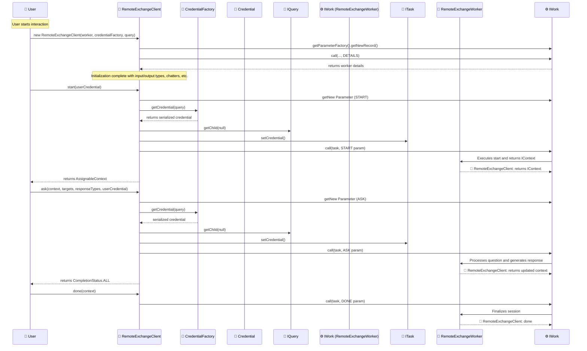

```mermaid
sequenceDiagram
    participant 👤 User
    participant 🧠 RemoteExchangeClient
    participant 🔐 CredentialFactory
    participant 🔐 Credential
    participant 📡 IQuery
    participant ⚙️ IWork (RemoteExchangeWorker)
    participant 🧾 ITask
    participant 💬 RemoteExchangeWorker

    Note over 👤 User: User starts interaction

    👤 User->>🧠 RemoteExchangeClient: new RemoteExchangeClient(worker, credentialFactory, query)

    🧠 RemoteExchangeClient->>⚙️ IWork: getParameterFactory().getNewRecord()
    🧠 RemoteExchangeClient->>⚙️ IWork: call(..., DETAILS)
    ⚙️ IWork-->>🧠 RemoteExchangeClient: returns worker details

    Note over 🧠 RemoteExchangeClient: Initialization complete with input/output types, chatters, etc.

    

    👤 User->>🧠 RemoteExchangeClient: start(userCredential)
    🧠 RemoteExchangeClient->>⚙️ IWork: getNew Parameter (START)
    🧠 RemoteExchangeClient->>🔐 CredentialFactory: getCredential(query)
    🔐 CredentialFactory-->>🧠 RemoteExchangeClient: returns serialized credential
    🧠 RemoteExchangeClient->>📡 IQuery: getChild(null)
    🧠 RemoteExchangeClient->>🧾 ITask: setCredential()
    🧠 RemoteExchangeClient->>⚙️ IWork: call(task, START param)
    ⚙️ IWork->>💬 RemoteExchangeWorker: Executes start and returns IContext
    💬 RemoteExchangeWorker-->>⚙️ IWork:🧠 RemoteExchangeClient: returns IContext
    🧠 RemoteExchangeClient-->>👤 User: returns AssignableContext

    
    👤 User->>🧠 RemoteExchangeClient: ask(context, targets, responseTypes, userCredential)
    🧠 RemoteExchangeClient->>⚙️ IWork: getNew Parameter (ASK)
    🧠 RemoteExchangeClient->>🔐 CredentialFactory: getCredential(query)
    🔐 CredentialFactory-->>🧠 RemoteExchangeClient: serialized credential
    🧠 RemoteExchangeClient->>📡 IQuery: getChild(null)
    🧠 RemoteExchangeClient->>🧾 ITask: setCredential()
    🧠 RemoteExchangeClient->>⚙️ IWork: call(task, ASK param)
    ⚙️ IWork->>💬 RemoteExchangeWorker: Processes question and generates response
    💬 RemoteExchangeWorker-->>⚙️ IWork:🧠 RemoteExchangeClient: returns updated context
    🧠 RemoteExchangeClient-->>👤 User: returns CompletionStatus.ALL


    👤 User->>🧠 RemoteExchangeClient: done(context)
    🧠 RemoteExchangeClient->>⚙️ IWork: call(task, DONE param)
    ⚙️ IWork->>💬 RemoteExchangeWorker: Finalizes session
    💬 RemoteExchangeWorker-->>⚙️ IWork:🧠 RemoteExchangeClient: done


```